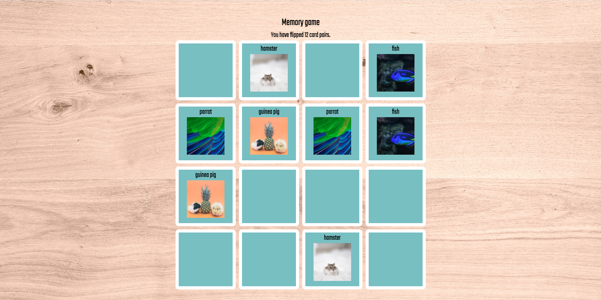

# Memory game - pets

## Introduction

This memory game includes eight pairs of cards with pet pictures. When a matching pair is flipped, the pair stays revealed. When there's no mathch, the pair shakes and becomes hidden. See how few card flips it takes you to reveal all the pairs! Try to beat the record 12 pairs!

## Technologies used

- React

## Live page

Live page link in Netlify is: https://main--pet-memory-game.netlify.app/.

## Visuals

